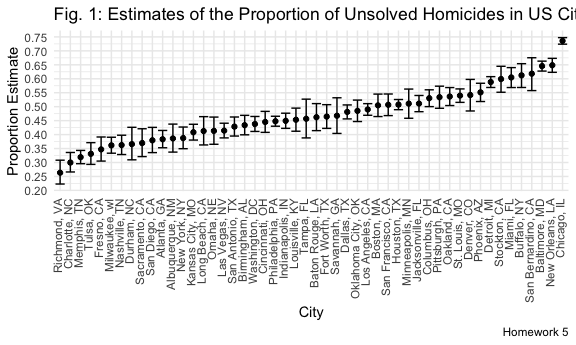
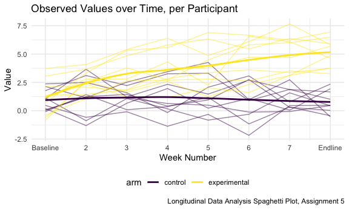

Homework 5, Module 7 (Iteration)
================
Emil Hafeez (eh2928)
11/11/2020

# Problem 1

First things first, read in the data, and describe it.

``` r
homicide_df = 
    read.csv("./data/homicide/homicide.csv")

homicide_df %>% summary()
```

    ##      uid            reported_date       victim_last        victim_first      
    ##  Length:52179       Min.   : 20070101   Length:52179       Length:52179      
    ##  Class :character   1st Qu.: 20100318   Class :character   Class :character  
    ##  Mode  :character   Median : 20121216   Mode  :character   Mode  :character  
    ##                     Mean   : 20130899                                        
    ##                     3rd Qu.: 20150911                                        
    ##                     Max.   :201511105                                        
    ##                                                                              
    ##  victim_race         victim_age         victim_sex            city          
    ##  Length:52179       Length:52179       Length:52179       Length:52179      
    ##  Class :character   Class :character   Class :character   Class :character  
    ##  Mode  :character   Mode  :character   Mode  :character   Mode  :character  
    ##                                                                             
    ##                                                                             
    ##                                                                             
    ##                                                                             
    ##     state                lat             lon          disposition       
    ##  Length:52179       Min.   :25.73   Min.   :-122.51   Length:52179      
    ##  Class :character   1st Qu.:33.77   1st Qu.: -96.00   Class :character  
    ##  Mode  :character   Median :38.52   Median : -87.71   Mode  :character  
    ##                     Mean   :37.03   Mean   : -91.47                     
    ##                     3rd Qu.:40.03   3rd Qu.: -81.76                     
    ##                     Max.   :45.05   Max.   : -71.01                     
    ##                     NA's   :60      NA's   :60

This raw dataset consists of 52179 rows and 12 columns. Data are
structured around individual-level homicide cases including an id
number, and then details location, arrest/resolution information, and,
often, demographic information regarding each victim. Several variables
are not of a tidied data type (e.g. not a factor, or numeric, or date
variable when this is prudent), and there is also missing data.

``` r
homicide_df = 
    homicide_df %>% 
  mutate(
    city_state = str_c(city, ", ", state),
    resolved = case_when(
      disposition == "Closed without arrest" ~ "unresolved",
      disposition == "Open/No arrest" ~ "unresolved",
      disposition == "Closed by arrest" ~ "resolved"
    )
  ) %>% 
  filter(city_state != "Tulsa, AL")
```

Total number of homicides in each city, and the number of unsolved
homicides.

``` r
aggregate_df = 
  homicide_df %>% 
  group_by(city_state) %>% 
  summarize(
    homicide_total = n(),
    homicide_unresolved = sum(resolved == "unresolved")
  ) %>% arrange(desc(homicide_total))
aggregate_df
```

    ## # A tibble: 50 x 3
    ##    city_state       homicide_total homicide_unresolved
    ##    <chr>                     <int>               <int>
    ##  1 Chicago, IL                5535                4073
    ##  2 Philadelphia, PA           3037                1360
    ##  3 Houston, TX                2942                1493
    ##  4 Baltimore, MD              2827                1825
    ##  5 Detroit, MI                2519                1482
    ##  6 Los Angeles, CA            2257                1106
    ##  7 St. Louis, MO              1677                 905
    ##  8 Dallas, TX                 1567                 754
    ##  9 Memphis, TN                1514                 483
    ## 10 New Orleans, LA            1434                 930
    ## # … with 40 more rows

Let’s estimate the proportion of homicides that are unsolved in
Baltimore, MD, using prop.test and then broom::tidy to clean the
results. The results are:

    ## [1] "Estimate: 0.65, Confidence Interval: (0.63,0.66)"

Now we run prop.test for each of the cities in the dataset, and extract
both the proportion of unsolved homicides and the confidence interval
for each. We use purr::map and map2 to create a tidy dataframe with
estimated proportions and CIs for each city.

``` r
#iterate the prop tests and tidied tests functions over each state to get a resulting df
results_homicide_df =
  aggregate_df %>% 
  mutate(
    prop_tests = map2(.x = homicide_unresolved, .y = homicide_total, ~ prop.test(x = .x, n = .y)),
    tidied_tests = map(.x = prop_tests, ~broom::tidy(.x))
  ) %>% 
  select(-prop_tests) %>% 
  unnest(tidied_tests) %>% 
  select(city_state, estimate, conf.low, conf.high)
```

Here is a plot which shows the proportions of unsolved homicides for
each city, with confidence intervals.

``` r
results_homicide_df %>% 
  mutate(city_state = fct_reorder(city_state, estimate)) %>% 
  ggplot(aes(x = city_state, y = estimate)) +
  geom_point() + 
  geom_errorbar(aes(ymin = conf.low, ymax = conf.high)) +
  theme(axis.text.x = element_text(angle = 90, vjust = .25, hjust = 1)) +
  scale_y_continuous(breaks = seq(0, 1, .05)) +
  labs(
    title = "Fig. 1: Estimates of the Proportion of Unsolved Homicides in US Cities",
    x = "City",
    y = "Proportion Estimate",
    caption = "Homework 5")
```



# Problem 2

We first create a tidy dataframe containing all data from the
longitudinal study, by combining the 20 CSV files. Then, we plot the
subject’s scores over time, and examine group differences.

``` r
path_df =
  tibble(
    path = list.files("./data/lda")
  ) %>% 
  mutate(path = str_c("./data/lda/", path),
         data = map(.x = path, ~read_csv(.x))
         ) %>% 
  unnest(data) %>% 
  mutate(
    path_separator = path
  ) %>% 
  separate(path_separator, into = c("arm", "subject_id"), sep = "_") %>% 
  mutate(
    arm = str_replace(arm, "./data/lda/con", "control"),
    arm = str_replace(arm, "./data/lda/exp", "experimental"),
    subject_id = str_replace(subject_id, ".csv", ""),
    subject_id = as.numeric(subject_id)
  ) %>% 
  arrange(path, arm, subject_id) %>% 
  pivot_longer(
    week_1:week_8,
    names_to = "week_number",
    values_to = "observed_value"
  ) %>% 
  mutate(
    week_number = str_replace(week_number, "week_", ""),
    week_number = as.numeric((week_number)),
    arm = as.factor(arm),
    path = str_c(arm, "_", subject_id)
  )
```

``` r
ggp_lda =
path_df %>% 
  ggplot(aes(x = week_number, y = observed_value, group = path, color = arm)) + 
  geom_line(alpha = .5) +
  geom_smooth(
    aes(x = week_number, y = observed_value, color = arm, group = arm), 
        alpha = 1, inherit.aes = F, se = F) +
   scale_x_continuous(
    breaks = c(1, 2, 3, 4, 5, 6, 7, 8), 
    labels = c("Baseline", "2", "3", "4", "5", "6", "7", "Endline")) +
  labs(
    title = "Observed Values over Time, per Participant",
    x = "Week Number",
    y = "Value",
    caption = "Longitudinal Data Analysis Spaghetti Plot, Assignment 5") 
ggp_lda
```

    ## `geom_smooth()` using method = 'loess' and formula 'y ~ x'



The plot appears to show the experimental arm and the control arm start
from a similar baseline with respect to their observed values, but over
time the control arm stays approximately the same while the experimental
arm appears to increase. The smoothed averages for each group help
illustrate this point.

# Problem 3

Create the function

``` r
set.seed(27)
sim_t_test = function(sample_size = 30, mu = 0, sigma = 5) {
  
  sim_data = tibble(
    x = rnorm(n = sample_size, mean = mu, sd = sigma),
  )
  
  t_test = t.test(sim_data, mu = 0)

  sim_data %>% 
    summarize(
      mu_hat = mean(x),
      p_value = pull(broom::tidy(t_test), p.value)
    )
}
```

Generate 5000 datasets from the model, using the mu = 0 (specified) all
the way through mu = 6. Cached.

``` r
sim_results = 
  tibble(
    true_mu = c(0:6)
  ) %>% 
  mutate(
    outputs = map(.x = true_mu, ~rerun(5000, sim_t_test(mu = .x))),
    estimates_df = map(outputs, bind_rows)
  ) %>% 
  select(-outputs) %>%
  unnest(estimates_df)
```

``` r
sim_results %>% 
  group_by(true_mu) %>% 
  mutate(
    tests_total = n(),
    null_rejected = sum(p_value < 0.05),
    proportion_rejected = (null_rejected / tests_total),
    true_mu = as.factor(true_mu)
  ) %>% 
  arrange(desc(proportion_rejected)) %>% 
  ggplot(aes(x = true_mu, y = proportion_rejected, color = proportion_rejected, group = true_mu)) + 
  geom_point(alpha = 1, size = 3) +
  scale_y_continuous(breaks = seq(0, 1, 0.1)) +
  labs(
    title = "Simulating Repeated Sampling for Power Demonstration",
    x = "True Mu",
    y = "Proportion of Simulations where Null Rejected",
    caption = "Simulations Power Plot, Assignment 5")
```


We note that, holding sample size and standard deviation constant, when
the effect size increases, the power increases.

Now, we show the average estimate of the sample mean on the y axis and
the true population mean on the x-axis.

``` r
sim_results %>% 
  group_by(true_mu) %>% 
  mutate(
    estimate_mean = mean(mu_hat),
    true_mu = as.factor(true_mu)
  ) %>% 
  arrange(desc(estimate_mean)) %>% 
  ggplot(aes(x = true_mu, y = estimate_mean, color = true_mu, group = true_mu)) + 
  geom_point(alpha = 1, size = 3) +
  scale_y_continuous(breaks = seq(0, 7, 1)) +
  labs(
    title = "Estimating the Value of Mu via Repeated Sampling",
    x = "True Mu",
    y = "Average Value of Sample Mean (mu_hat)",
    caption = "Assignment 5")
```


Now, we show the average estimate of the sample mean on the y axis and
the true population mean on the x-axis, for only samples in which the
null hypothesis was rejected (p is less than 0.05).

``` r
sim_results %>% 
  group_by(true_mu) %>% 
  filter(p_value < 0.05) %>% 
  mutate(
    estimate_mean = mean(mu_hat),
    true_mu = as.factor(true_mu)
  ) %>% 
  arrange(desc(estimate_mean)) %>% 
  ggplot(aes(x = true_mu, y = estimate_mean, color = true_mu, group = true_mu)) + 
  geom_point(alpha = 1, size = 3) +
  scale_y_continuous(breaks = seq(0, 7, .5)) +
  labs(
    title = "Estimating the Value of Mu via Repeated Sampling",
    x = "True Mu",
    y = "Average Value of Sample Mean (mu_hat)",
    caption = "Assignment 5")
```


Using only samples in which the null was rejected, the average estimate
of the sample mean is not approximately equal to the true value of mum
until mu (true population mean) is 4 and above (and to some extent, is
3). This is likely the case because for the simulations when mu is 4 and
above, a larger number of samples find evidence to reject the null
hypothesis, and are used in the estimation process after filtering.

When we simulate larger population means, the effect size and power are
higher when the true population mean is high and the null hypothesis is
that the mean is equal to 0 (holding sample size and standard deviation
constant). When effect size is higher, we have higher power, and thus
the circumstances in which we reject the null hypotheses are more likely
to be accurate decisions; alternatively, when we have lower effect size
(so when the true mean is lower) and thus lower power, we absorb more
noise, in that the samples in which we reject the null hypotheses may be
false positives and also showing very high values relative to the true
mean.
